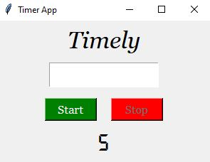
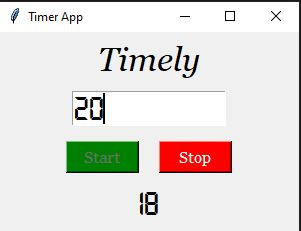

# Timely - A Python Timer App

## 🛠️ Description
Timely is a simple Python-based timer application made using the Tkinter library.
My goal for this project was to implement my own application, so others can use it, or contribute to it.
I have been making contributions to other open source projects, so thought it would be nice to create my
own and flip the script. Timely allows users tp set a timer, start it, and stop it with just two buttons.
The graphical interface is simple, and leaves room for expansion. A visual countdown of the timer is also
displayed, as well as an alert once the timer has finished.

Feel free to fork the project, download the Python files, and edit them as you wish. You can also contribute by:

1. Improving functionality
2. Fixing bugs
3. Adding new features (such as countdown sounds, notifications, or customizable themes)
Even a small contribution is appreciated!

## ⚙️ Languages or Frameworks Used
- Modules Required:
    - python (3.12.7)
    - 'tkinter'
    - 'tkextrafont' (For custom timer font)

## 🌟 How to run

You can type this command on your terminal to run the scripts.
`python <main.py>`

if this doesn't work try,
`python3 <main.py>`

To stop it you can press CTRL + C

## 📺 Demo

Some demos of the scripts.

## 🤖 Author
This script is by brendanddev (Brendan Dileo).

Brendan Dileo -> https://github.com/brendanddev
This is my github profile.